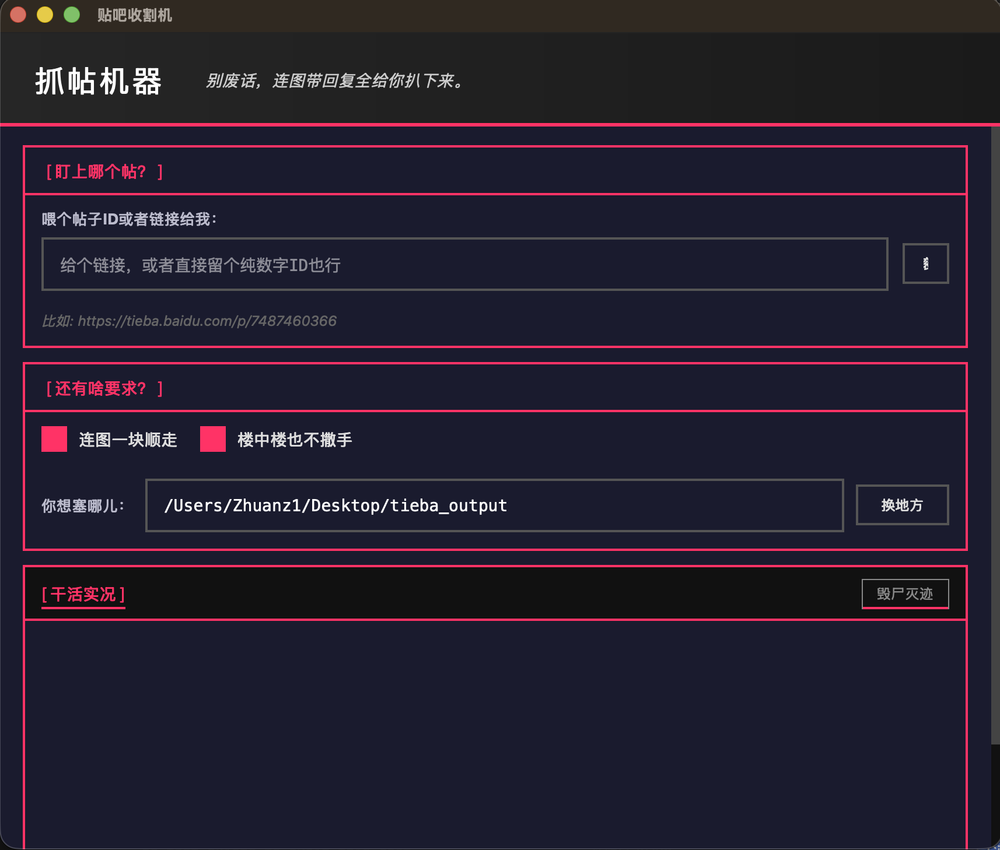

<p align="left">
  
</p>

# [ 抓帖机器 ] TiebaReaper

> 别废话，连图带回复全给你扒下来。

我真是受够了贴吧。
这玩意只有黑底和高亮粉红。
不整虚的，就为了拔贴吧的毛。

## 它能干啥？


<table width="100%" style="border: 2px solid #FF3366; background: #111;">
<tr>
<td width="28%" valign="top">
  
  <br><b style="color:#FF3366;">寸草不生</b>
</td>
<td width="72%" valign="top">
  楼主废话和几十页回帖全盘接收。<br>
  楼中楼的对骂记录都给你留仓。<br>
  10 秒钟榨干千层高楼。
</td>
</tr>
<tr>
<td width="45%" valign="top">
  
  <br><b style="color:#FF3366;">连锅端走</b>
</td>
<td width="55%" valign="top">
  贴图和表情包全下到本地。<br>
  防和谐，防抽楼。<br>
  百度图床挂了你也不怕。
</td>
</tr>
<tr>
<td width="15%" valign="top">
  
  <br><b style="color:#FF3366;">整齐划一</b>
</td>
<td width="85%" valign="top">
  最后吐给你个纯净 Markdown。<br>
  多图并茂，排版极度利落。<br>
  自己慢慢用 Obsidian 欣赏吧。
</td>
</tr>
</table>

## 怎么折腾？

别问我啥是云端部署。
你有 Python 环境对吧？

**第一步：上依赖**

```bash
pip3 install PyQt6
```

**第二步：跑起来**

```bash
python3 tieba_app.py
```

（用 Mac 的懒鬼直接双击 `./run.sh`）

**第三步：开干**
扔个链接，或填贴吧纯数字 ID。<br>
点【搞快点！】。然后看进度条飞。

## 界面长啥样

 


这个界面没用任何垃圾组件库。
纯手搓 PyQt6 表格与样式。
渐变拉满，硬切变色。
不对称边距，治好你的强迫症。
完全没有 Emoji 当图标这回事。

## 吐出的货

比如那个贴。
代码跑完后，你桌面上多个文件夹。
我扒得那叫一个干干净净：

```text
7487460366_帖子标题/
├── 帖子标题.md        
└── images/
    ├── img_0001.jpg
    └── 一堆乱七八糟的配图.jpg
```

Markdown 包含发帖人和点赞。
精确到哪年哪月发的牢骚。

## 忠告

1. 拔毛悠着点，别搞崩百度服务器。
2. 内置 0.5 秒延迟，防查水表。
3. 代码开源了，出事千万别找我。
