# 【推演战报】朝鲜战争 ocs korea全剧本

> **所在吧**: 兵棋研究所吧  
> **发帖人**: FWJ💥  
> **发帖时间**: 2021-08-10 15:45:22  
> **总回复数**: 60  
> **点赞数**: 59  
> **收藏数**: 21  
> **帖子链接**: https://tieba.baidu.com/p/7487460366

---

## 第 1 楼（楼主）

**发帖人**: FWJ💥 | **时间**: 2021-08-10 15:45:22 | **点赞**: 23

被困在老家了，能玩多少是多少

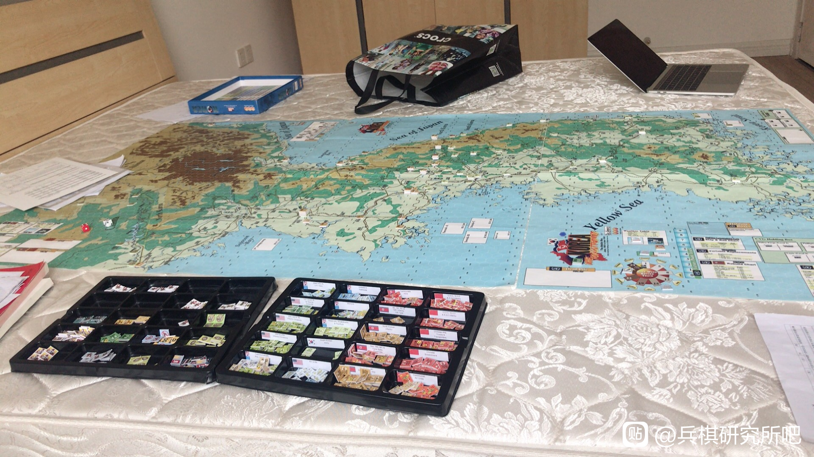

---

## 第 2 楼

**发帖人**: FWJ💥 | **时间**: 2021-08-10 15:51:14 | **点赞**: 2

1.双方兵力分布
朝鲜：在战争初期朝鲜已经聚集了大量的部队在三八线，后方最多的部队也在平壤距离前线十分近（相比于韩国）
韩国：在刚接触这款游戏的时候我也十分疑惑，为什么大量的韩国部队都在后方？据我了解的战史当时韩国的建立本身不得半岛人民民心，自韩国建立开始在南方就一直有大量的游击队，战争爆发的时候，大量的部队还在后方清剿游击队。（这也是为什么所有的师都是不满员状态，大量的师被拆分，以维持各个地区的治安。）

---

## 第 3 楼

**发帖人**: 我辈浪人某🍀 | **时间**: 2021-08-10 16:08:00 | **点赞**: 0

前排支持

展开 1 条楼中楼回复

> **FWJ💥** (2021-08-10 22:20:20): [表情:吐舌]

---

## 第 5 楼

**发帖人**: FWJ💥 | **时间**: 2021-08-10 16:18:48 | **点赞**: 1

3．韩国方面的战略十分简单，那就是一个字跑，这可不是胆小。在之前我曾经尝试如果韩国部队不像历史上那样跑，反而全力坚守汉城会发生什么？结果就是虽然刚开始北方的部队会很难打，但是在平壤的第二波部队一上来，再加上大炮飞机开路，汉城最终还是会被拿下，而且会消耗韩国很多的有生力量，以至于在后面的釜山包围圈当中，根本就没有足够的军队去坚守。（这也给朝鲜玩家一个启示，一定要歼灭有生力量。）

展开 2 条楼中楼回复

> **FWJ💥** (2021-08-10 19:52:59): 第二楼被吞了在后面。

> **FWJ💥** (2021-08-10 22:44:39): 第二，进攻计划被吞了

---

## 第 6 楼

**发帖人**: FWJ💥 | **时间**: 2021-08-10 16:22:43 | **点赞**: 1

4. 1950年6月26日朝鲜战争爆发。
天气剧本规定可飞行。
先手朝选择先动（不能让韩国军队先跑）
增瑗阶段运气不错，获得的还可以。

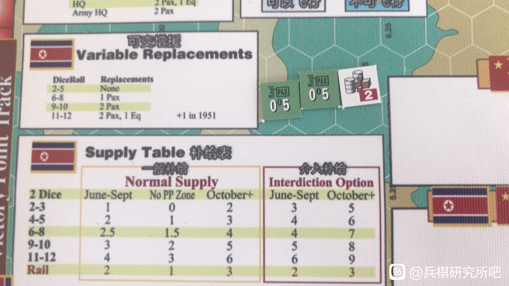

---

## 第 7 楼

**发帖人**: FWJ💥 | **时间**: 2021-08-10 17:19:34 | **点赞**: 1

5.移动阶段：
发生了两场战斗。（两个箭头）
一战斗群在接下来的进攻阶段应该可以完成目标。
二战斗群有点麻烦，因为移动阶段移动力不足以ov，必须要在进攻阶段打出足够高的战果，才能在进击阶段会师议政府。
第三战斗群比较顺利在ov当中进击，并且在后方的机械化骑兵以极高的速度穿插到了东豆川后方，给第二战斗群带来了很大的便利。
第456战斗群都按期定计划进行。

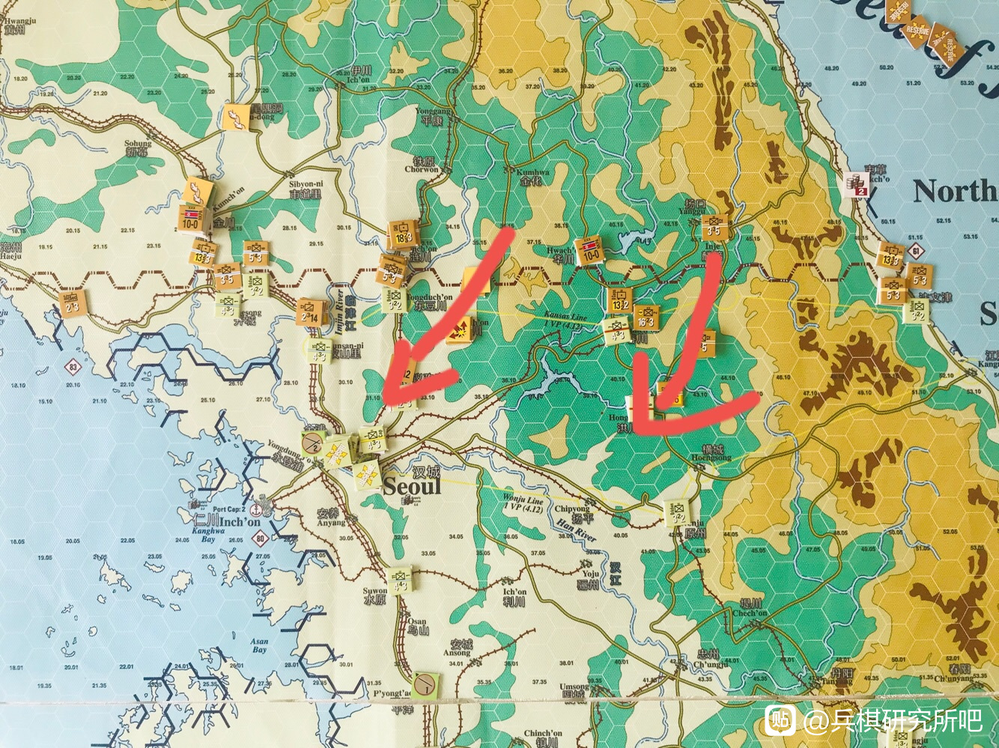

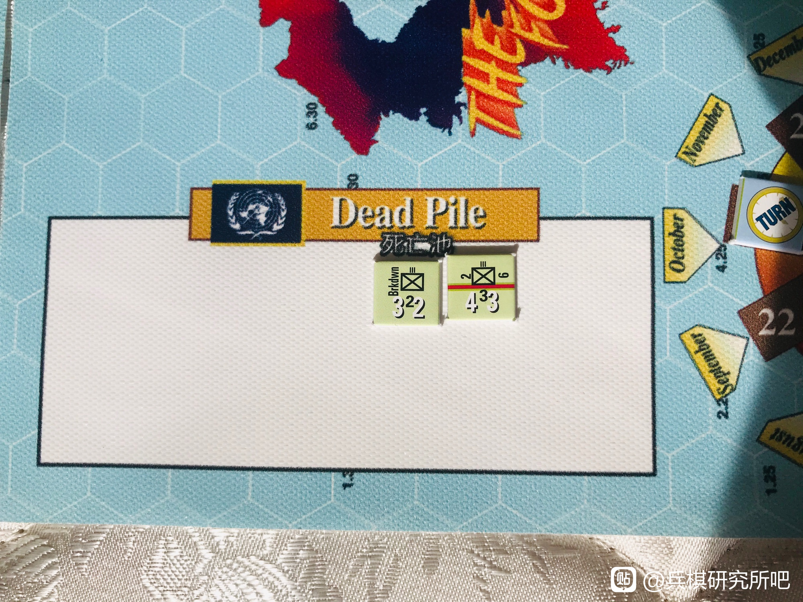

---

## 第 9 楼

**发帖人**: FWJ💥 | **时间**: 2021-08-10 18:27:01 | **点赞**: 2

7.战斗阶段结束汉城肯定是摸不着了议政府还可以强攻试一下。

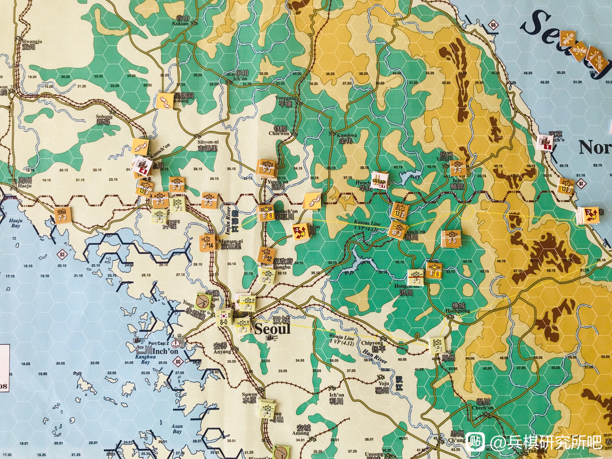

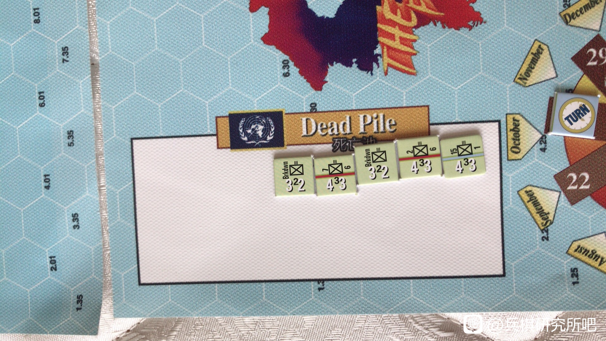

---

## 第 10 楼

**发帖人**: FWJ💥 | **时间**: 2021-08-10 18:31:53 | **点赞**: 0

8北方行动结束，这局骰子其实一般般，最终还是没有像历史一样打进了汉城。这个行动轮的战果十分丰富，重创了第六师全歼了第7师

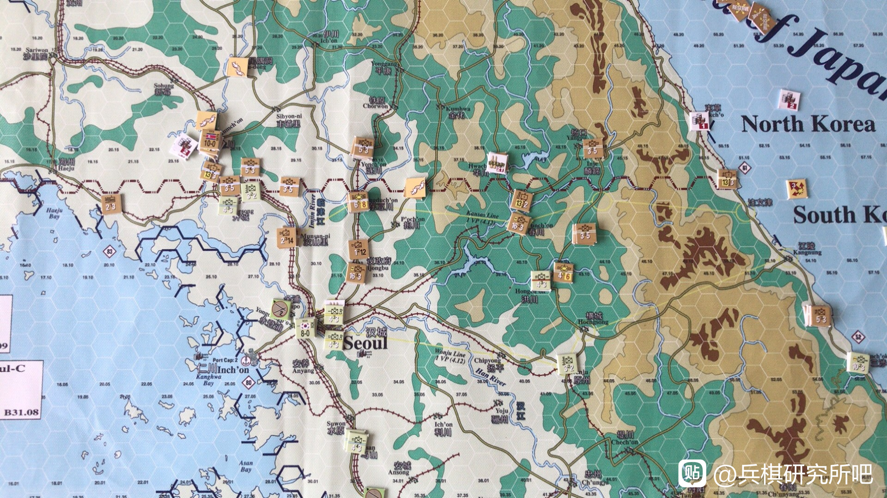

---

## 第 11 楼

**发帖人**: AzΩRe | **时间**: 2021-08-10 18:32:01 | **点赞**: 0

前排支持！

展开 1 条楼中楼回复

> **FWJ💥** (2021-08-10 22:20:13): [表情:吐舌]

---

## 第 12 楼

**发帖人**: FWJ💥 | **时间**: 2021-08-10 18:38:10 | **点赞**: 1

9韩国的回合。这回合看能不能把部队辙到大田以内。

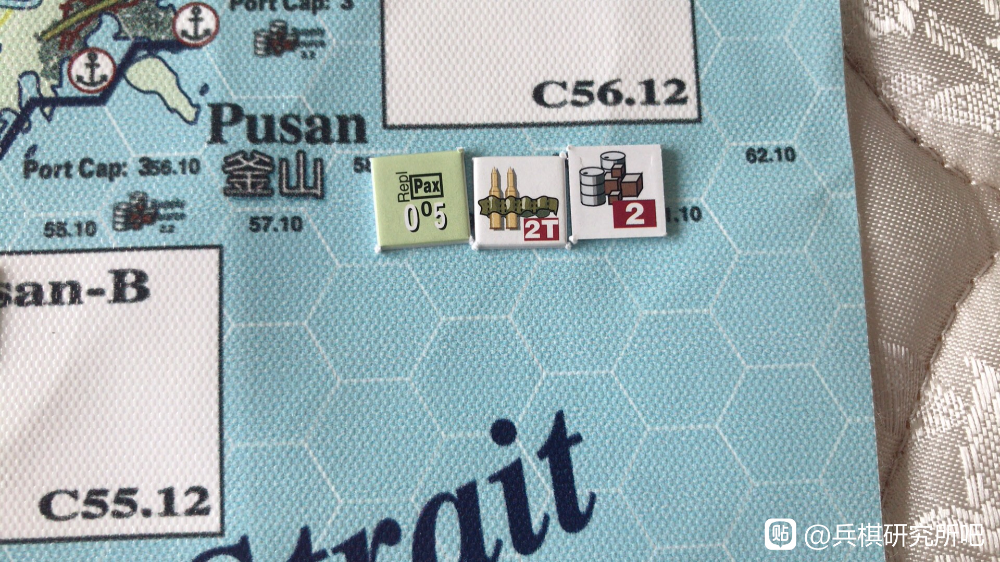

---

## 第 13 楼

**发帖人**: 倒霉菌落 | **时间**: 2021-08-10 19:07:49 | **点赞**: 0

好耶，支持[表情:滑稽]

展开 1 条楼中楼回复

> **FWJ💥** (2021-08-10 22:20:04): [表情:吐舌]

---

## 第 14 楼

**发帖人**: FWJ💥 | **时间**: 2021-08-10 19:22:26 | **点赞**: 2

10.韩国行动结束。
我有些时候在想我是不是跑得太快了[表情:委屈]

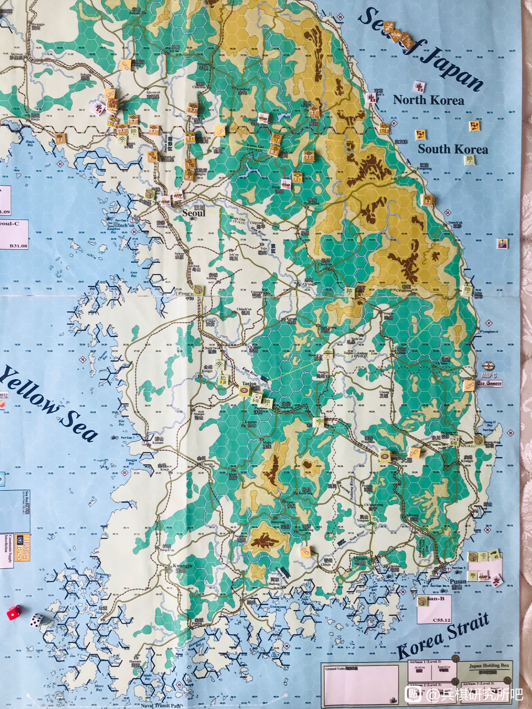

---

## 第 15 楼

**发帖人**: FWJ💥 | **时间**: 2021-08-10 19:24:53 | **点赞**: 1

11.另外讨论一下韩国的防守策略。一般来说，进攻都是按着铁路线展开的。汉城算是一个十分重要的点从地图上不难看出所有北方的铁路线，想到了南方都要经过汉城。一旦汉城被占整个南方的补给都将会被切断。这也是仁川登录能这么成功的原因之一。铁路线到了汉城再次分成两条一条是单轨从汉城一直到安东。这一条，我们只需要沿线防守就行了，另外一条双轨则是从汉城到天安在分成两条，然后到大田。一般来说，我们只需要在汉城到安东沿线进行初期和从汉城到大田沿线进行阻击，效率会高得多。（另外一条单轨从地图上可以看到最南指挥到宝城。如果北方向沿这条铁路线进行进攻的话，只能到马山。
以上只是我的想法，如果有观点可以一起讨论。[表情:你懂的]

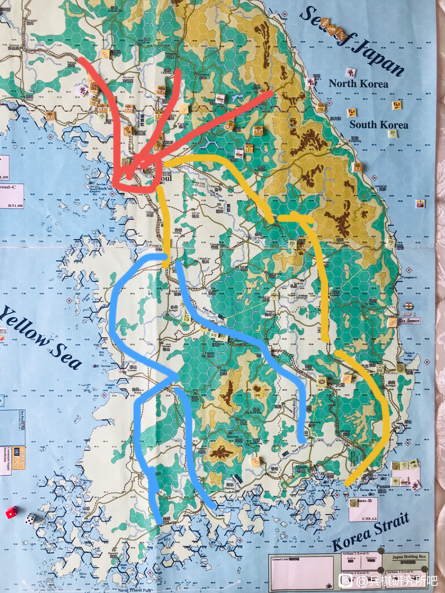

---

## 第 16 楼

**发帖人**: FWJ💥 | **时间**: 2021-08-10 19:30:38 | **点赞**: 3

服了

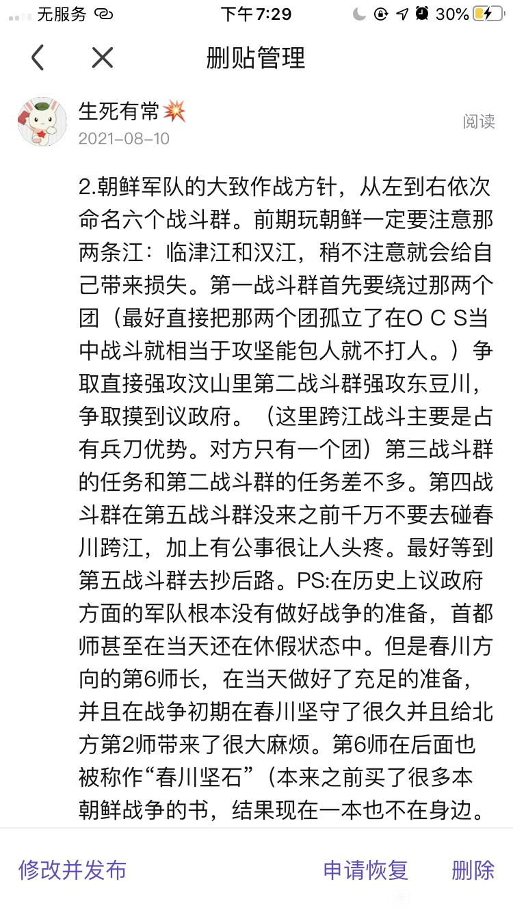

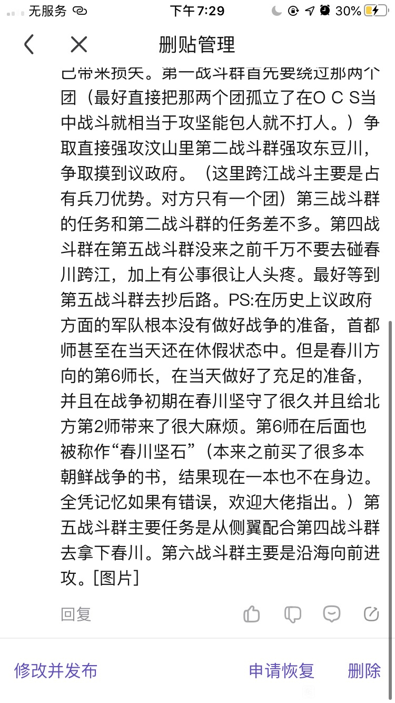

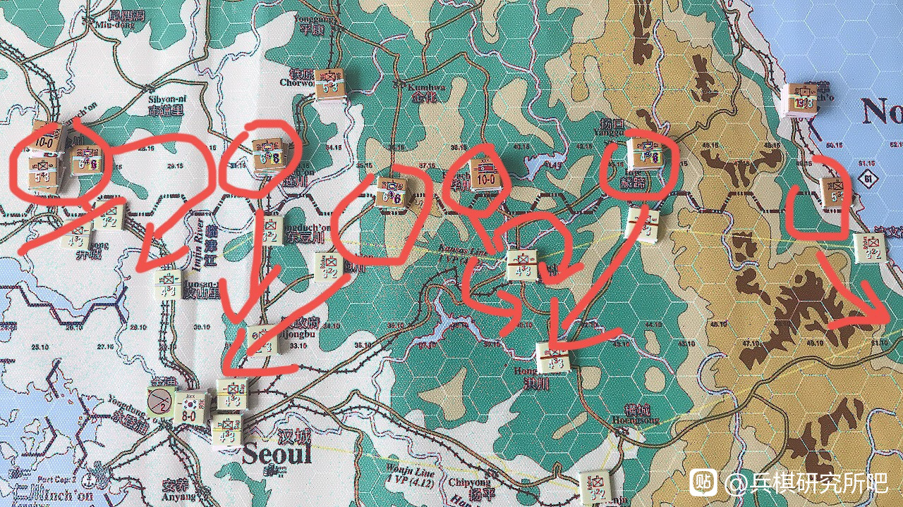

---

## 第 17 楼

**发帖人**: FWJ💥 | **时间**: 2021-08-10 20:20:13 | **点赞**: 2

12.顺便就来聊聊北方的反登录措施。
如果要达到仁川登录的效果那登陆点就必须要能一次性切断通往南方的一切铁路。并且还要离南方有一段距离防止回防。（可能还有）通过研究铁路我发现如果在平壤和元山永兴同时进行一次登录的话，其实效果和仁川登录差不多。（这两个点都是十分重要的铁路节点。）所以在部署防御部队的时候要在各个节点重点防御

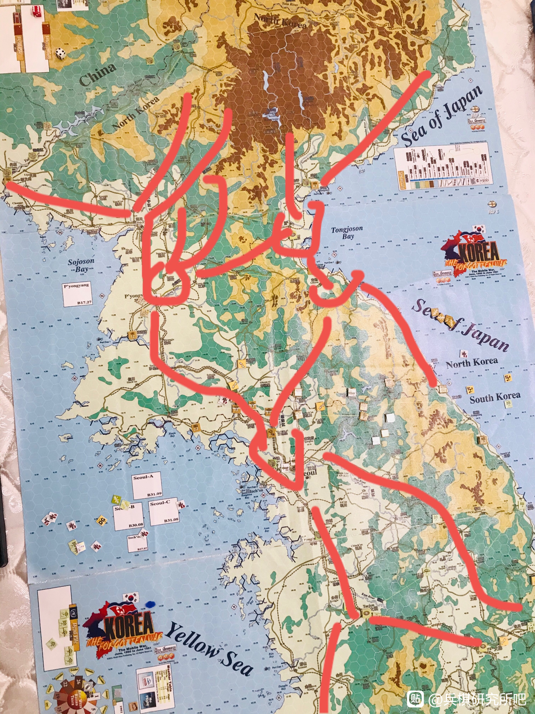

---

## 第 18 楼

**发帖人**: FWJ💥 | **时间**: 2021-08-10 21:42:24 | **点赞**: 1

13.即使知道对方可能在登录地点那兵力分配也是个极大的问题。在登录日那天，美军至少都会有71攻击力的兵力。即便是选择了在平壤和元山两头进行登录。那每边也会有35点，如果想要完美的防守的话至少需要142点（还是不计素质和飞机优势下）10个师，而在登录日哪天北方只有16个师，设计师真的是算死了，剩下六个师刚好满足釜山包围圈。[表情:你懂的]这是之前无聊的时候瞎想的，这盘也是算是验证一下，所以说这局我会打得特别保守。（只在釜山投入六个师）无意间看了一下增援，在登录日之前，将会有六个师刚好可以用这六个来防御平壤和元山。所以前期可以不在朝鲜留人。把韩国压到一定程度之后，就可以开始安排防守，等待志愿军

展开 1 条楼中楼回复

> **FWJ💥** (2021-08-10 22:40:55): 其实这里还有一些缺陷。因为素质飞机，个人认为至少得要10个师，那汉城的五个师可以在九月即将来临的时候将围攻釜山的兵力撤退一起防守。

---

## 第 19 楼

**发帖人**: 重型潘兴chen | **时间**: 2021-08-10 21:44:06 | **点赞**: 0

赶上直播

---

## 第 20 楼

**发帖人**: FWJ💥 | **时间**: 2021-08-10 21:48:58 | **点赞**: 1

14．无聊做了一张表，展示了从剧本开始到登录日双方的单位总战斗力变化（1.开局，我默认韩国将会损失三八线附近的单位，2没有计算素质飞机之间的差异。）我感觉飞机和素质的差异，应该可以抵得上一半的战斗力。

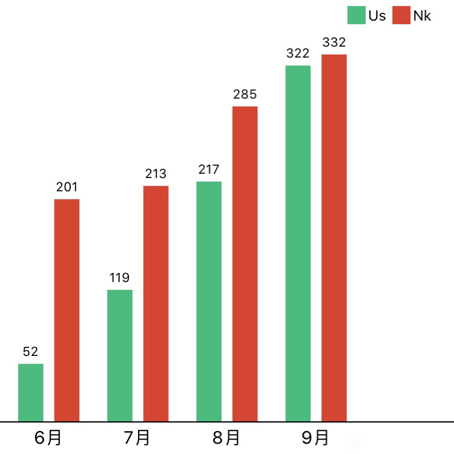

---

## 第 21 楼

**发帖人**: FWJ💥 | **时间**: 2021-08-10 22:10:38 | **点赞**: 0

15上面说的可能（十分）乱，主要是想说一下我战略是怎么来的，总结一下我朝鲜的战略就是在6，7月全军猛攻釜山包围圈（通过上面的图表可以看到这两个月北方兵远多于南边而且韩国也没有多少飞机。）8月开始构造公事，不主动打，只求6个师在圈中（有图表可以看到八月南边的兵刀基本上就是北方的一半的加上素质和飞机，基本可以持平。）9月全军退到大田一带。撑到志愿军来（9月兵力基本相等，加上飞机完全可以反打了）（如果退到汉城一带的话，如果能撑住是小胜，更何况有极大可能撑不住。但如果仅仅是退到大田一带的话，即使退一些那也是小胜。）

展开 1 条楼中楼回复

> **FWJ💥** (2021-08-10 22:41:42): 推到大田还有一个点就是离汉城近，可以相互照应。

---

## 第 23 楼

**发帖人**: 盖伦约瑟夫😿 | **时间**: 2021-08-10 22:33:40 | **点赞**: 0

顶[表情:真棒]

---

## 第 24 楼

**发帖人**: FWJ💥 | **时间**: 2021-08-11 10:37:05 | **点赞**: 1

16. 1950年6月29日。第二回合 朝先动 天气可飞
北方获得了3sp
移动阶段

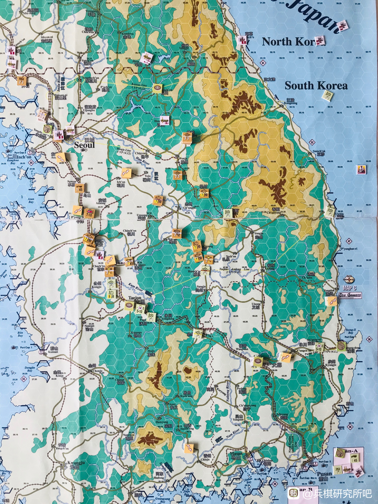

---

## 第 25 楼

**发帖人**: FWJ💥 | **时间**: 2021-08-11 10:43:54 | **点赞**: 1

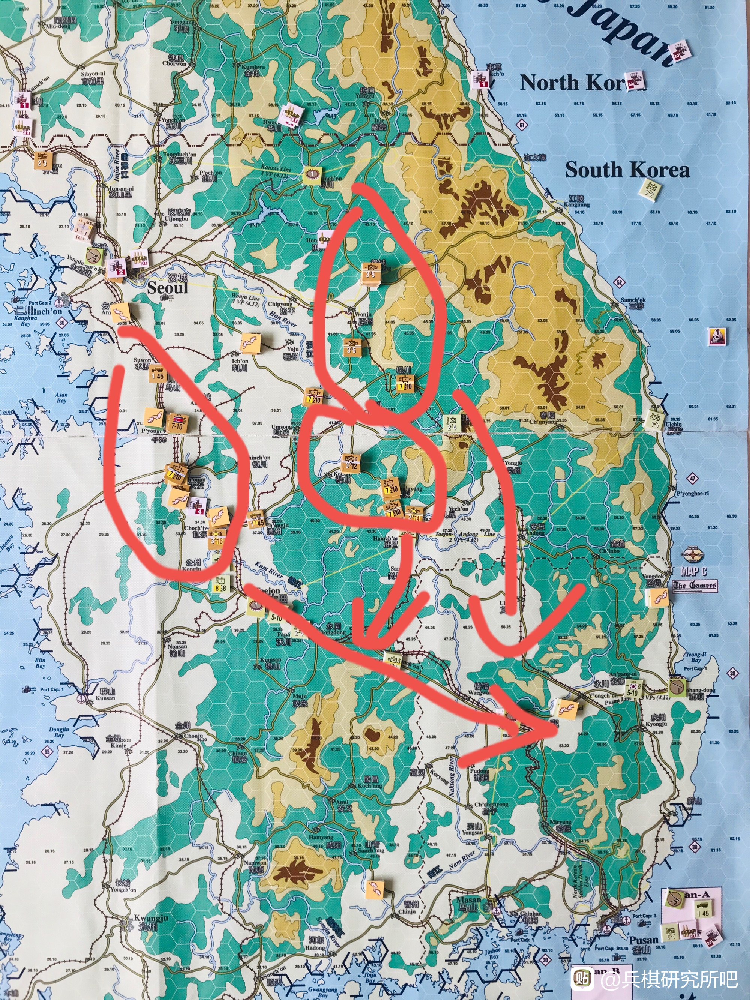

---

## 第 26 楼

**发帖人**: FWJ💥 | **时间**: 2021-08-11 10:52:46 | **点赞**: 2

25楼文字没了，大意就是在分成三个战斗群，一战斗群从大田方向强攻，第二战斗群尝试从金泉方向切断大田敌人的后路。赶到另外一个没有任何地形优势，处在平原的补给源群山（虽然和福山方向是反的，但是我们的战略目不是打釜山而是敌人的有生力量。）第三战斗群可能有点难，本来是按传统向安东攻打，但是韩国卡到了一个很好的点丹阳，这个地方处在高原又是铁路的节点。估计很长时间才能攻破。

---

## 第 27 楼

**发帖人**: FWJ💥 | **时间**: 2021-08-11 11:04:20 | **点赞**: 1

17.那韩国有防御策略吗[表情:滑稽]这次大田战役部署确如常山之蛇，击其首而尾至，击其尾而首至，击其中而首尾皆至

---

## 第 28 楼

**发帖人**: FWJ💥 | **时间**: 2021-08-11 11:19:18 | **点赞**: 1

18进攻阶段朝鲜强攻锦江，其他方向兵力太少，没有发起进攻。

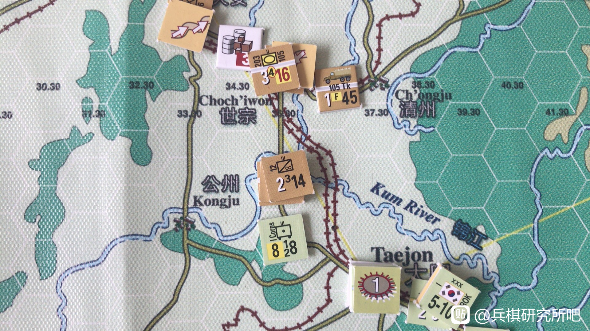

---

## 第 29 楼

**发帖人**: FWJ💥 | **时间**: 2021-08-11 11:21:18 | **点赞**: 0

19.韩国移动阶段结束。韩国将一部分兵力调往威昌，反击长途跋涉了的第12师坦克营。

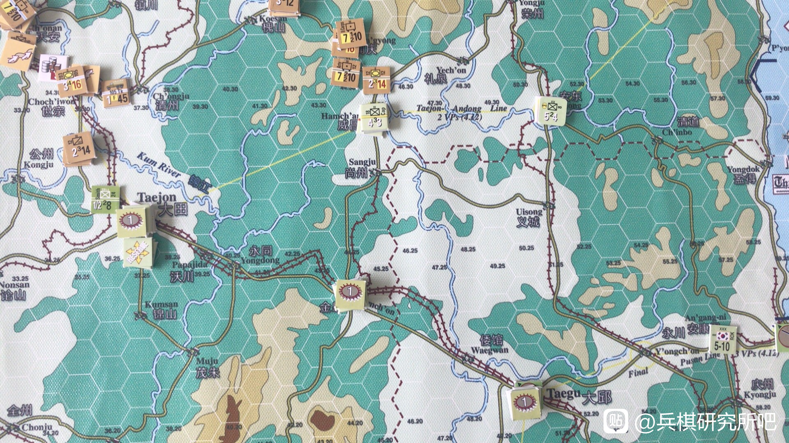

---

## 第 30 楼

**发帖人**: FWJ💥 | **时间**: 2021-08-11 11:22:35 | **点赞**: 0

十二师的坦克营成为了朝鲜在这次战争当中第一个被全部歼灭的单位。

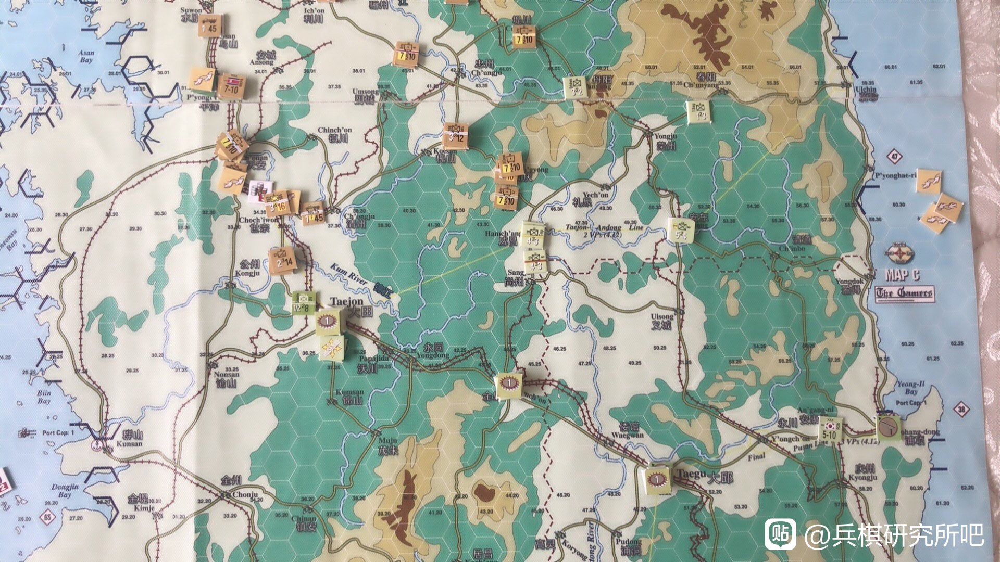

---

## 第 31 楼

**发帖人**: FWJ💥 | **时间**: 2021-08-11 11:58:52 | **点赞**: 0

20. 1950年7月1日第三回合。
之前一直都忘照北方构造的公事了

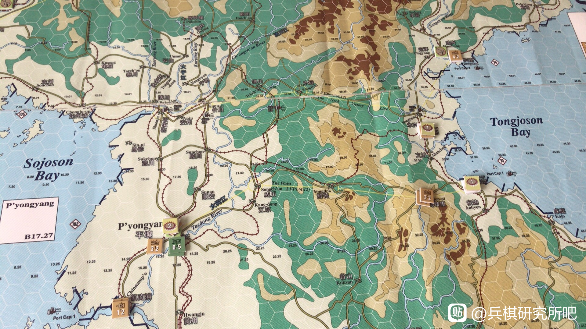

---

## 第 32 楼

**发帖人**: FWJ💥 | **时间**: 2021-08-11 12:10:01 | **点赞**: 0

21.朝先动，移动阶段，大田这个时候已经被半包围了。但第二战斗群。移动力不够。恐怕很难切断韩国人的后路。

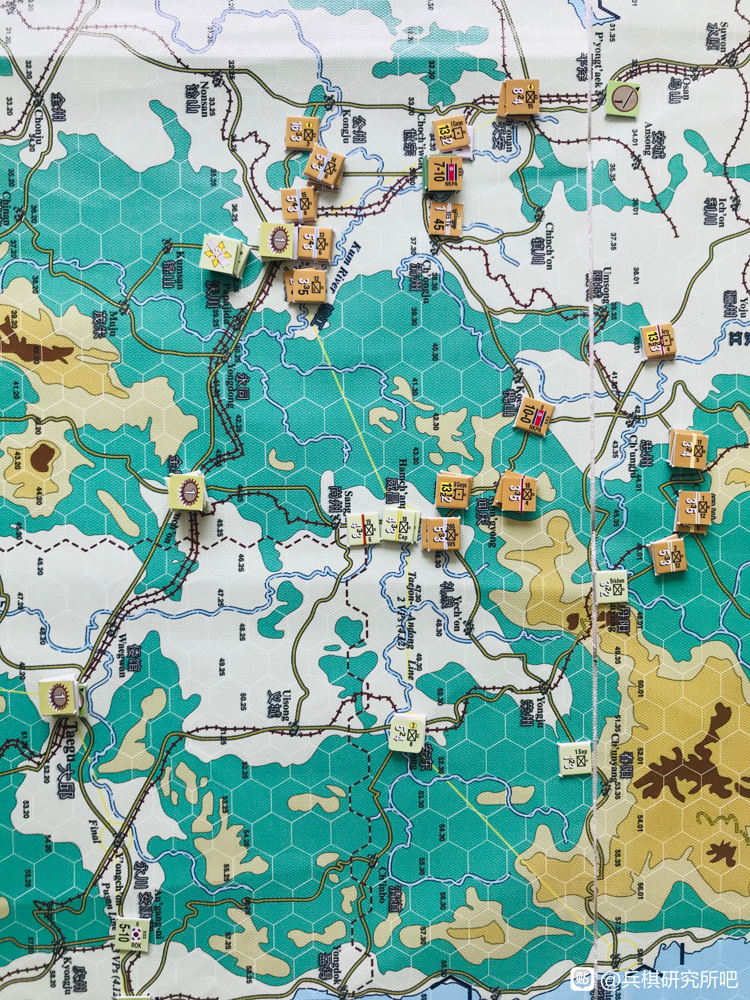

---

## 第 33 楼

**发帖人**: FWJ💥 | **时间**: 2021-08-11 12:14:28 | **点赞**: 0

22.大田的强攻打响了韩国预备的炮兵和朝鲜的炮兵同时开火，都对对方造成混乱，朝奇袭了，但是骰子真的很坏最后朝鲜损失一个步兵团韩国撤退一个步兵团。

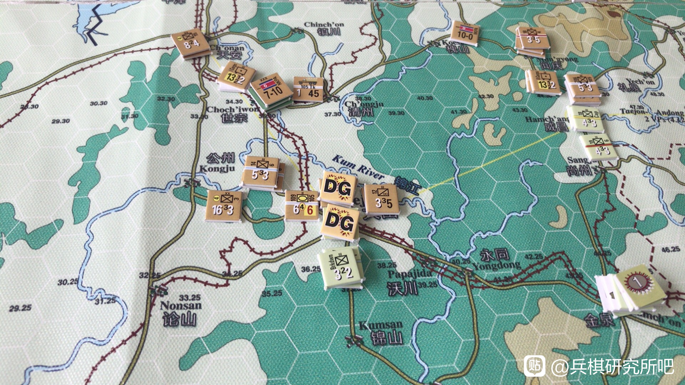

---

## 第 34 楼

**发帖人**: FWJ💥 | **时间**: 2021-08-11 12:32:12 | **点赞**: 1

23.韩国行动结束可以看到美帝的飞机已经来了，接下来的朝鲜进攻肯定不会好受。

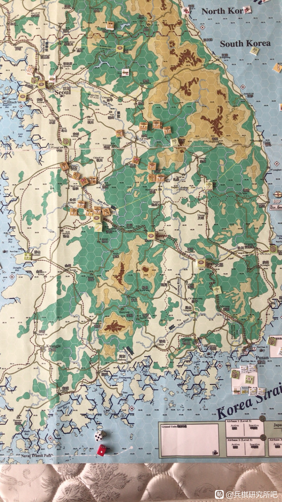

---

## 第 35 楼

**发帖人**: FWJ💥 | **时间**: 2021-08-11 13:12:01 | **点赞**: 0

24.1950年7月5日，韩国先动。调整了一下防御姿态。轮到朝鲜的时候第一战斗群后方的两个师到了将一起参与攻坚。第二战斗群因为耽误了太多时间，韩国已在金泉处构造了坚固的防线。几乎无法攻破。（1个半师加上3级要塞）于是，调整任务从西方向第三战斗群处包抄。

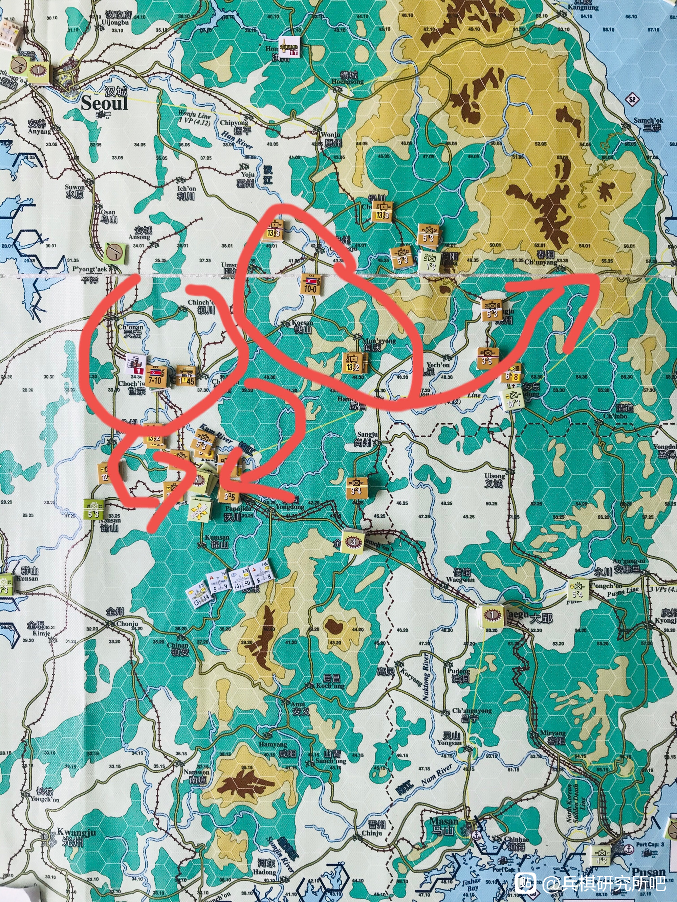

---

## 第 36 楼

**发帖人**: FWJ💥 | **时间**: 2021-08-11 13:12:47 | **点赞**: 1

另外做一下笔记，在前期不要构造太多的工事，现在补给已经有点不够了。

---

## 第 37 楼

**发帖人**: FWJ💥 | **时间**: 2021-08-11 13:24:17 | **点赞**: 1

23. DG一片

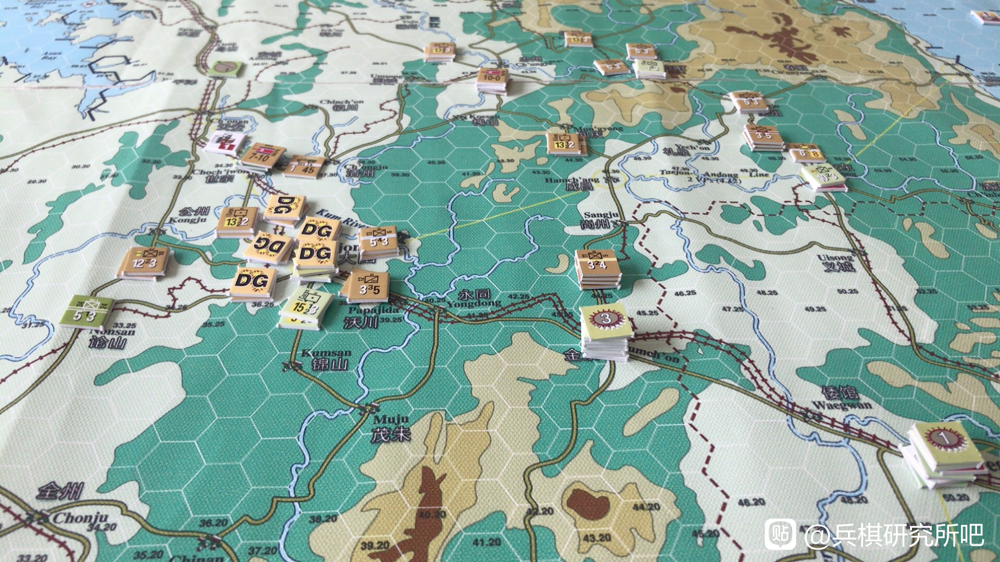

---

## 第 38 楼

**发帖人**: FWJ💥 | **时间**: 2021-08-11 14:25:44 | **点赞**: 1

26. 1950年7月8日第五回合，朝鲜还是没有打下大田，美军的飞机越来越多，金泉方向也派遣的一个师去支援。第二战斗群已经包围了金泉，但是由于兵力悬殊还暂时无法发起进攻。这两个城市短时间内不用担心。但是第三战斗群已经从东边快速南下，目前韩国在安东的兵力只有一个半师

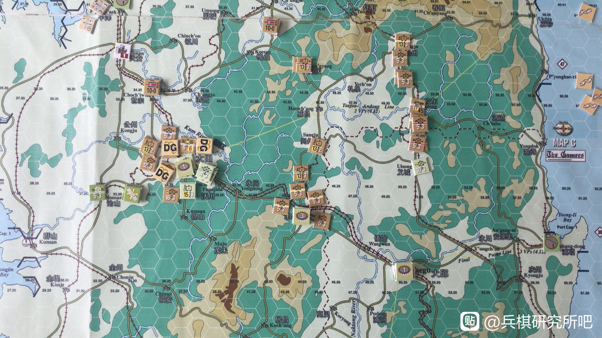

---

## 第 39 楼

**发帖人**: FWJ💥 | **时间**: 2021-08-11 14:51:29 | **点赞**: 1

27. 1950年7月13日。第六回合这个回合，韩国先动，无法飞行韩国果断跑路辙走了大田军队（四个轮子就是快。）而且金泉被包围了，大田没有具象化补给，跑路的部队动用小金库重创了朝鲜第5师

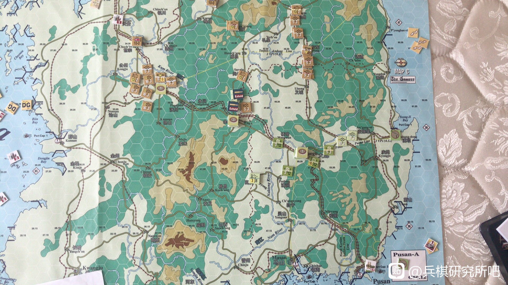

---

## 第 40 楼

**发帖人**: 地下之海 | **时间**: 2021-08-11 16:05:30 | **点赞**: 0

加油加油！

展开 1 条楼中楼回复

> **FWJ💥** (2021-08-11 17:12:21): 谢谢[表情:吐舌]

---

## 第 41 楼

**发帖人**: FWJ💥 | **时间**: 2021-08-11 17:15:59 | **点赞**: 0

28.对了，从第五回合就是我新找到的朋友指挥啦，但愿他没有看到我的贴子。[表情:你懂的]他目前的战略是想和历史一样，在釜山和我打消耗战不过大田已经是我的进攻最深线，他提前撤走我就可以提前构造工事了

---

## 第 42 楼

**发帖人**: ☞他的猫♤☜ | **时间**: 2021-08-11 17:35:55 | **点赞**: 0

支持

---

## 第 43 楼

**发帖人**: 冰箱里的里脊🎓 | **时间**: 2021-08-11 18:16:10 | **点赞**: 0

小白一个，楼主大大，在这一类战旗游戏里面是怎样判断双方战力并且又是怎样计算伤亡的，难道是有一个较为复杂的算法吗[表情:疑问]

---

## 第 45 楼

**发帖人**: FWJ💥 | **时间**: 2021-08-11 23:34:27 | **点赞**: 1

29.顺便聊下战报的形式，才刚开始我一个人玩可以每个阶段的写详细一点。但现在有人的话为了保证推演的流畅性时候可能都会采用回合来写，不会每个战斗每个阶段的写，但大致的战略和方针和重要的战役还是会详细写的。

---

## 第 46 楼

**发帖人**: FWJ💥 | **时间**: 2021-08-12 11:12:22 | **点赞**: 1

28.朝鲜后动，虽然在大田扑了个空，但逃走的基本上只有美军和炮兵部队。大量的韩国部队以及一个整编师被包围在了拥有完整的防御体系的碾庄，呸，金泉.第二战斗群虽然付出了惨重的代价，但最终还是切断了退路。如果下回合，朝鲜能获得主动权，并且天气还是十分糟糕的话。这个大饺子就吃定了。[表情:你懂的]

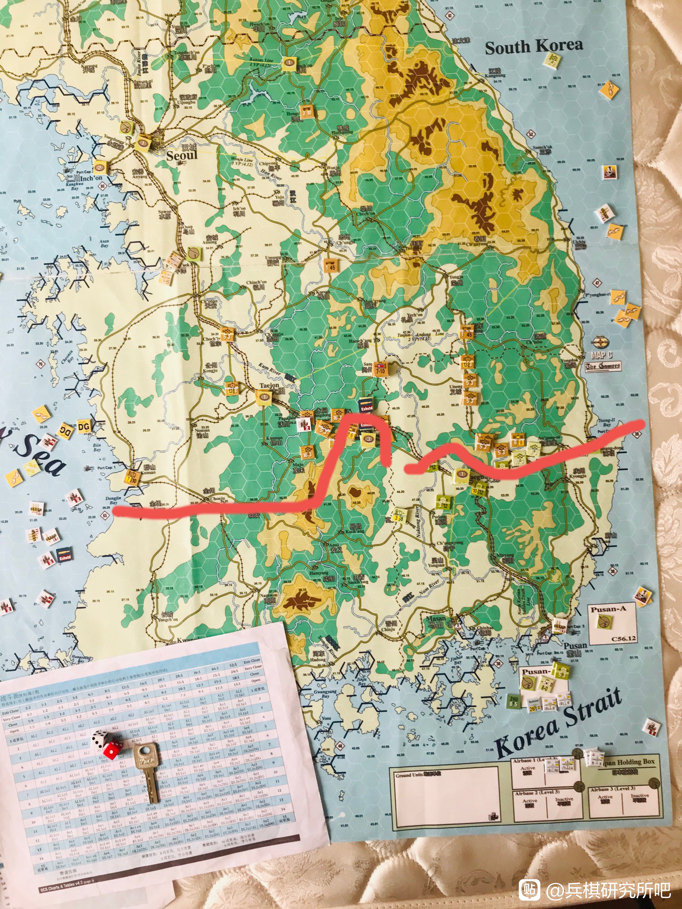

---

## 第 47 楼

**发帖人**: FWJ💥 | **时间**: 2021-08-12 11:18:08 | **点赞**: 1

29. 1950年7月15日，第六回合，不可飞行。朝鲜的天气还是比较糟糕的，基本上有三分之一的概率都会。朝鲜获得主动权选择先手
PS:关于我为什么又开始打金泉[表情:你懂的]我昨天跟朋友说了一下仁川登录点选择，我感觉我可能透露了我一部分战略。必须要给一定的压力，才能让我在接下来的回合好好修防线。（其实就是眼馋三级工事）

---

## 第 48 楼

**发帖人**: FWJ💥 | **时间**: 2021-08-12 11:42:42 | **点赞**: 0

30.清泉方向的总攻开始了，约有四个师和一个坦克营参与了这场战斗，韩国因为恶劣的天气无法派出飞机进行轰炸。并且因为第三战斗群直接逼近了大邱。连一些炮火支援和援军无法拍过去。
这次总攻因为公事实在厉害，反而被反奇袭了，双方都是o1

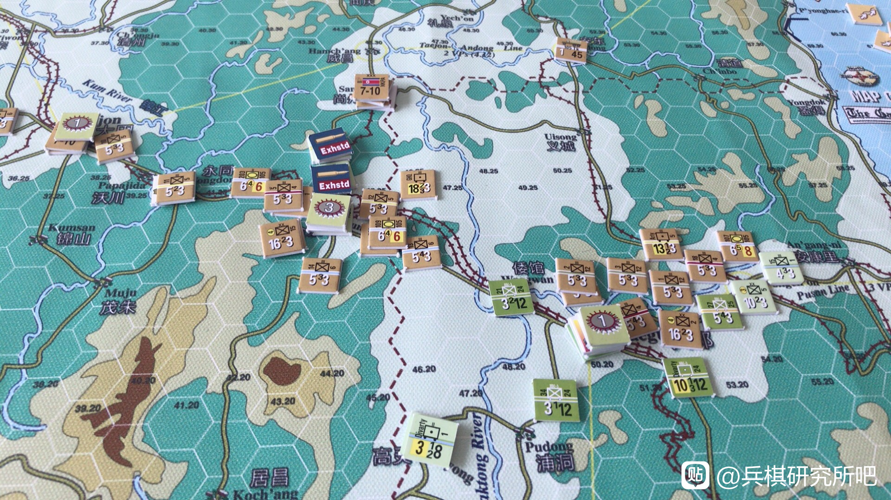

---

## 第 49 楼

**发帖人**: FWJ💥 | **时间**: 2021-08-12 11:55:13 | **点赞**: 1

31.第六回合终，金泉方向，除了驻军被困在在城外面的军队全部突围，只有一个团突围出去了在两个回合之后返回。第三战斗群给大丘很大的压力，一部分军队甚至直接度过了洛东江。现在，韩国必须要将部队用来填满战线无法派部队进行救援。

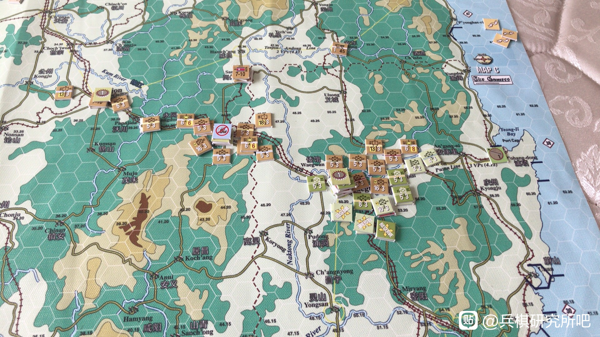

---

## 第 50 楼

**发帖人**: FWJ💥 | **时间**: 2021-08-12 12:05:30 | **点赞**: 0

32. 1950年7月19日。第七回合。过了这么多天的坏天气，现在终于可以飞行了。现在，韩国已经拥有了大量的飞机，可以预见的是之后只要是朝鲜进攻的部队都将会被盖上混乱标记。带朋友玩了一下他现在对空军还是不是特别熟悉，我们就采用了可选规则当中的封锁，可以将建船和飞机放入封锁格之后，每25战斗力就会减少北方1T

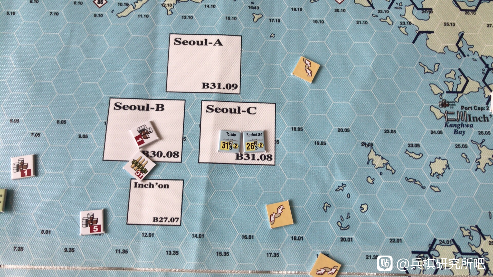

---

## 第 51 楼

**发帖人**: FWJ💥 | **时间**: 2021-08-12 12:29:28 | **点赞**: 0

33.韩国先手结束。金泉驻军因为耗损全军覆没。美帝的B二九对汉城进行了运输破坏。（我还以为他，留着b二九来轰炸)

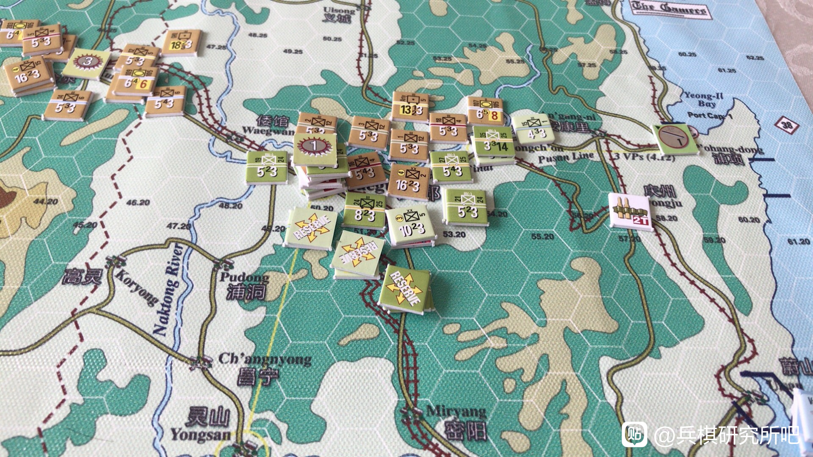

---

## 第 52 楼

**发帖人**: FWJ💥 | **时间**: 2021-08-12 12:43:52 | **点赞**: 0

34.第七回合就这么平静的度过去了。朋友现在很不理解我为什么不立刻发起进攻，我现在更头疼，因为有运输破坏，加上封锁后防御上来的sp就没有多少。维持防守和工事都不移，更别说发起进攻。
Ps大致防线。

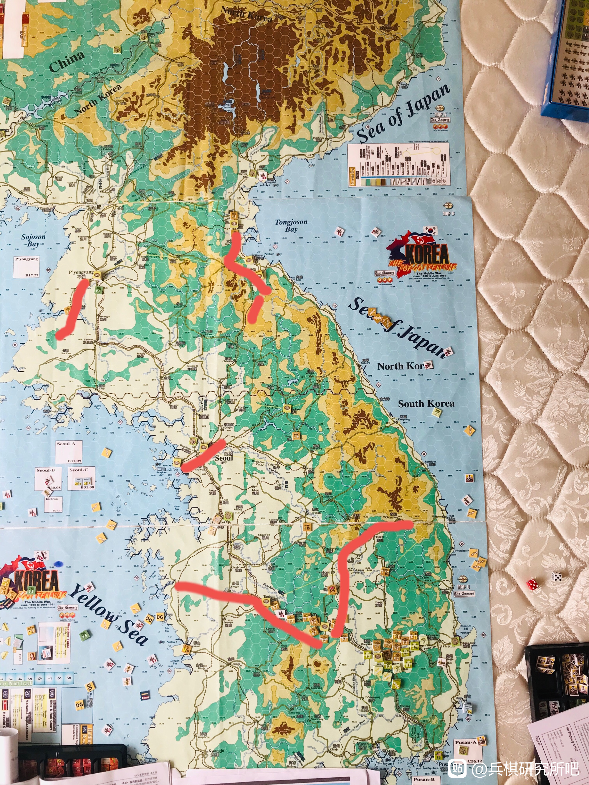

---

## 第 53 楼

**发帖人**: FWJ💥 | **时间**: 2021-08-12 12:45:38 | **点赞**: 0

35.经过金泉会战得到一个经验一个地方有再好的工事也没有用，如果没有整体完整防线的话。突破其中一个点是十分简单的。（所以说在后方构造的工事有点失败。）

---

## 第 54 楼

**发帖人**: FWJ💥 | **时间**: 2021-08-12 15:13:07 | **点赞**: 0

35. 1950年7月22日第八回合，韩国发起了一场反击攻击，对在洛东江的桥头堡，这次进攻大捷第2师彻底失去战斗力。（损失2点）朝鲜在这个回合趁着美军没有飞机继续构造防线。

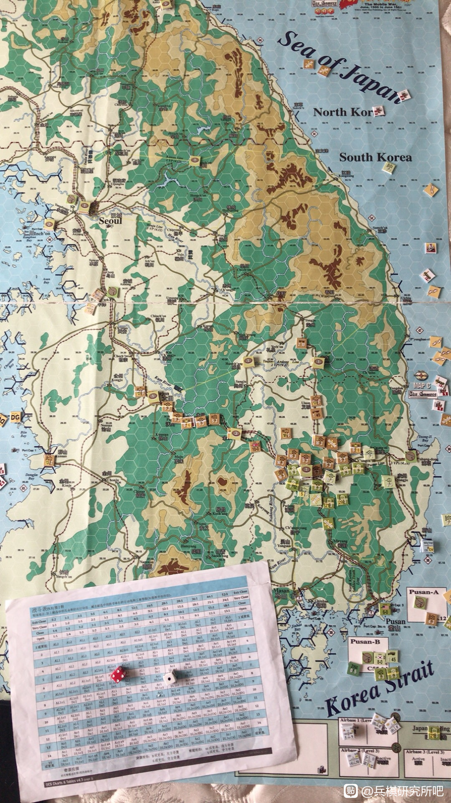

---

## 第 55 楼

**发帖人**: FWJ💥 | **时间**: 2021-08-12 16:37:27 | **点赞**: 2

36. 1950年8月1日第11回合。这段时间特别无聊。因为坏天气韩国方面只能靠船运来运补给，而且其中大部分要用来运援军，而朝鲜方面就是不停地修工事。现在又是我精分了（朋友回家了）

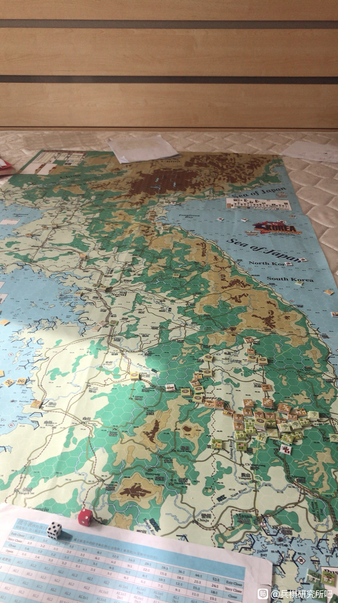

---
